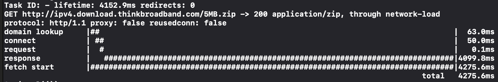

# Other Debugging Tools

- [Other Debugging Tools](#other-debugging-tools)
  - [cURL Command Output](#curl-command-output)
  - [Monitor Connection Metrics](#monitor-connection-metrics)

RealHTTP provides a set of tools you can use to debug issues with your network communication.

## cURL Command Output

Debugging platform issues can be frustrating.  
RealHTTP allows you to produce the equivalent cURL representation of any `HTTPRequest` instance for easy debugging.

```swift
let client: HTTPClient= ...
let request =  HTTPRawRequest().resourceAtURL("http://...")

// Print the cURL representation of the request
print(request.cURLDescription(whenIn: client))
```

This should produce:

```sh
$ curl -v \
	-X GET \
	-H "Accept-Language: en;q=1.0, it-US;q=0.9" \
	-H "User-Agent: HTTPDemo/1.0 (com.danielemargutti.HTTPDemo; build:1; iOS 14.5.0) RealHTTP/0.9.0" \
	-H "Accept-Encoding: br;q=1.0, gzip;q=0.9, deflate;q=0.8" \
	"http://ipv4.download.thinkbroadband.com/5MB.zip"
```

## Monitor Connection Metrics


RealHTTP gathers `URLSessionTaskMetrics` statistics for every `HTTPRequest`. `URLSessionTaskMetrics` encapsulates detailed information about the underlying network connection and request and response timing.  
This information may be really useful for spotting bottlenecks in your communication or for gathering statistics on network usage.

You can find this information inside the `HTTPRawResponse`'s `metrics` property. It returns an `HTTPRequestMetrics` instance with the following info:

- `task`: origin `URLSessionTask` of the metrics.
- `redirectCount` number of redirects before obtaining the response.
- `taskInterval` total time spent executing the task.
- `metrics`: a list of transaction metrics entries.

Each item of the `metrics` property can be expanded into an `HTTPMetric.Stage` object which describes the type of operation (`domainLookup`, `connect`, `secureConnection`, `request`, `server`, `response`, `total`) along with the respective `interval` (start, end, and duration).

This kind of data can be tricky to read so RealHTTP allows you to print a console-friendly graphical representation using the `render()` function:

```swift
let req = HTTPRequest {
    $0.url = URL(string: "http://ipv4.download.thinkbroadband.com/5MB.zip")!
    $0.transferMode = .largeData
    $0.method = .get
}
        
req.$progress.sink { progress in
    print("Downloading \(progress?.percentage ?? 0)")
}.store(in: &observerBag)
        
let response = try await req.fetch(client)
print(response.metrics?.render() ?? "")
```

Print the following result on console:

<p align="center">

</p>
