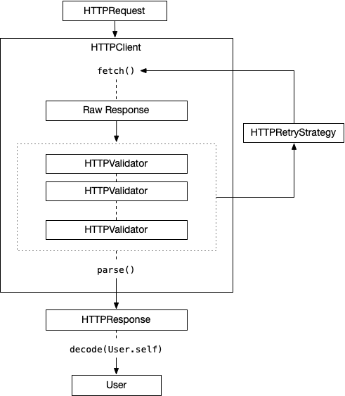

# Introduction

RealHTTP provides an elegant type-safe interface to build and execute asynchronous HTTP requests.  
At the hearth of this library there is URLSession, the modern Apple implementation of networking infrastructure.  
Best of all RealHTTP is lightweight and with no external dependencies. 

## Client Components

RealHTTP defines the following foundamental objects as HTTP client:

- `HTTPClient`: this is the container where requests are executed. It handles common requests configuration options along with session data (cookies, headers and so on). According to your needs you can create a custom client or use the `shared` one.
- `HTTPRequest`: defines a single request along with their configuration, url, parameters, body and so on. It allows you to easily define a single request in a type-safe manner without the hassle to setup the raw settings of an http communication (for example it supports multipart, json encoding, different parasmeters encoding, progress tracking, metrics collection and more).
- `HTTPResponse`: Request's `fetch()` function produces an async response. This objects contains all the relevant information of the response including error parsing, raw data and url connection stats. `decode()` function of response allows you to transform a raw response to a valid business object.
- `HTTPValidator`: when a request is received it can be validates by client's `validators`. Validators can be chained and each one can ask for a retry, transform the result or handle the custom business logic and error handling of your web service implementations.

This is a simple flow of an http request from the beginning to the end decode phase:

## Stub Components

If you need to make mocked requests, for example to test your client implementation, the RealHTTP's integrated stubber will become your best friend.  
Stubber main components are:

- `HTTPStubber`: it's a singleton object where your stub rules are handled. Consider it a sort of local webservice for your client which can handle replies coming from your app. You can enable or disable the stub at anytime.
- `HTTPStubRequest`: this object contains a set of matching rules (`matchers`) and the associated responses (`responses`) based upon the request's http method. When a new request is received the stubber check along defined `requests` and if a match is found it uses its responses.
- `HTTPStubMatcher`: this is a protocol you can implement to check if a particular stub request is matched. Typically you will never need to make a custom matcher; RealHTTP offers many built-in matchers including regex, uri template based and more.
- `HTTPStubResponse`: defines a protocol which produce an `URLResponse` based upon received `URLRequest`.
- `HTTPStubIgnoreRules`: you can also defines one or more ignore rules which should be not handled by the stubber.

